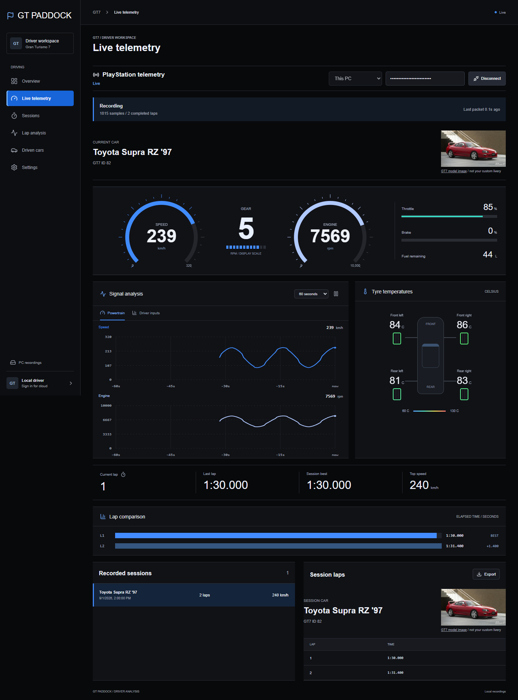
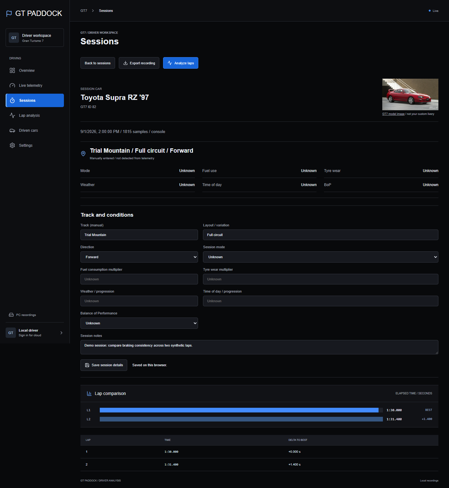
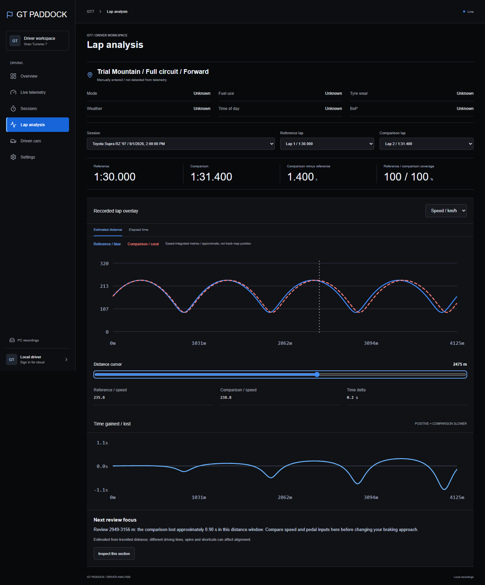

# GT Paddock

A local-first Gran Turismo 7 driving companion built with React and Vite. The app is prepared for Vercel hosting and optional Supabase authentication and session-summary storage. Hosting is not required for local telemetry.

See the [roadmap](docs/roadmap.md) for Race Engineer follow-ups and deferred AI Car Build Assist.

## Run

See the [screenshots](#screenshots) for a preview of the driving workspace.

```sh
npm ci
npm run dev -- --port 4178
```

Start the [PC companion](companion/README.md) using **Start GT Paddock Companion.cmd**, select **Copy code** in its pairing window, then paste into Live telemetry and Connect. The code is masked by default and stays out of startup logs in window mode. Terminal-only launches still print it. The web app holds the pairing code in memory, not persistent storage; refreshing requires pairing again. Navigation between pages keeps the connection alive. See [pairing flow and security](docs/pairing-flow.md).

## Driver Workspace

- Overview: loaded recording totals, recent sessions, personal bests grouped by car and manually assigned track.
- Live telemetry: instruments, live traces, tyre temperatures and recording status.
- Race engineer: spoken completed-lap updates for races and time trials, with fuel estimates and planned pit reminders.
- Sessions: search/filter, completed laps, manual track/layout labels, notes and JSON export.
- Lap analysis: two laps from the same session with speed, RPM, throttle, brake and gear overlays.
- Driven cars: automatically derived from recorded sessions, not the owned GT7 garage.
- Settings: companion status, storage information and account sign-in.

The UI loads up to 50 recent session summaries. Totals describe that loaded set, not the user's whole GT7 career. Simulation is excluded from driving totals and driven cars. Timed lap minutes sum completed lap times and do not claim total play time.

In This PC mode, Save session details stores track labels, settings and notes alongside the recording in SQLite. Existing browser-only details remain visible as a fallback; save them once to make them durable. Cloud-mode edits still remain browser-local.

## Live Race Engineer

When the engineer is running and you navigate elsewhere, a sticky status bar shows its mode and current radio state, plus Return to engineer, Mute/Unmute and Stop. It controls the same engineer instance; navigation does not restart speech or recording. Stopping from the bar stops only the engineer, not the companion recorder. The bar disappears on the engineer page or when stopped, and account changes still reset the workspace.

Before starting, the readiness strip shows companion connection, driving-data state and audio availability (not a guarantee that device audio has been tested). Essentials are mode, optional target, and race-only race length/pit lap. Advanced settings starts collapsed and contains callout frequency, voice, individual callouts and online-voice consent. Starting requires a companion status response; fresh driving is not required to arm the engineer. A compact running-plan summary keeps your entered settings visible outside the drawer. Stopping retains values in memory; no new persistent preferences are stored.

Starting the engineer automatically switches to the Pit Radio Console. Stop, mute and volume stay visible; Settings opens a keyboard-accessible desktop drawer or mobile sheet. Race plans and additional callouts remain locked while running. Stopping restores the inline settings without discarding their values.

The transmission bars animate only after the browser reports speech playback starting, and stop on completion, cancellation, mute or failure. They indicate speaking activity, not measured audio amplitude. Reduced-motion preferences disable movement. The console shows the current/last callout, current lap when actively driving, recorded lap times and the existing car identity/photo. Unsupported speech uses text only. Starting a new engineer run clears the previous callout history.

Pair the companion, open **Race engineer**, choose **Race** or **Time trial**, then select **Start engineer**. Race length and planned pit lap are optional manual inputs. Time trial compares newly completed laps with the current session best, including laps recorded before starting the engineer. It does not verify GT7 lap validity.

The engineer stays running across app pages, but stops on reload/account change. Stop and mute cancel speech; pause, loading, off-track, stale data and disconnect silence driving callouts without replaying missed messages. Optional connection alerts are the only exception to off-track silence. Keep the browser awake. Background-tab and mobile lock-screen audio are not guaranteed. Callouts and settings are in-memory only; the latest 50 messages remain visible while the app is open.

Race fuel warnings need a race length and three consecutive, consistent full-lap consumption measurements (four observed lap boundaries). Refuelling, missing data and discontinuities reset the estimate. These are conservative estimates, not guaranteed strategy advice. Pit reminders follow the entered lap, not a detected pit window.

Additional callouts use recorded values and explicit inputs only:

- Time-trial previous-lap comparison: exact difference between two consecutive newly observed lap times, including equal times. Every completed lap reports all comparisons; Key updates reports improvements of at least 0.1 seconds only.
- Time-trial target streaks: counts consecutive recorded laps at or below the manually entered target. Every completed lap announces from three onward; Key updates announces three, then multiples of five. A missed target, changed target, gap, pause/resume or new session resets the streak. No target means no streak callouts. Both time-trial options have individual toggles and remain subject to the existing message-length limit and cooldown.

- Recorded pace trends: three consecutive newly observed lap times, each change at least 0.1 seconds in the same direction. Reports progressively quicker/slower times, not their cause. Gaps, pause/resume and new sessions reset the comparison.
- Target lap time: optional `m:ss` or `m:ss.SSS` input for either mode. Reports the exact recorded difference to millisecond precision; blank disables it.
- Race progress: remaining laps against your entered race length. Reaching that length is not treated as proof the actual race ended.
- Pit preparation: at a completed-lap boundary, announces when the entered pit lap is next, followed by the existing reminder on the planned pit lap. Starting after a boundary does not replay missed reminders.
- Race session-best comparisons: compares each completed lap with the recorded session best, including an exact match or improvement. Key updates reports improvements immediately at lap completion and routine gaps every third lap. No cross-session record or lap-validity claim is made.
- Five-lap consistency: reports the range of five consecutive newly observed lap times. Gaps, pause/resume and new sessions reset the window. Every completed lap uses a rolling five-lap window; Key updates reports it on lap numbers divisible by five when the window is complete.
- Connection alerts: off by default, explicitly opt in before starting. After observing a fresh connection, reports loss after two seconds continuously unavailable/stale, and restoration after one second continuously fresh. Packet freshness expires after three seconds. Fresh menu/paused packets do not count as lost connectivity. Startup waiting is silent. Alerts remain deduplicated while muted and are not replayed on unmute; stop disables them. These report delivery status, not a guessed cause.

Every completed lap enables routine timing and target comparisons, with enabled progress and trends where available. Key updates reduces race timing to every third lap and retains time-trial session-best improvements; it adds new pace-trend directions, target attainment/loss, and race-plan milestones at 5, 3, 2, 1 and 0 laps remaining. Fuel and pit reminders remain available in both frequencies. Messages prioritize plan/fuel information and explicit comparisons over routine detail, with at most four message parts and the existing six-second cooldown. Pace, progress and preparation can be individually disabled before starting.

No microphone, AI API key or companion update is needed. Voices reported as local by the browser are enabled by default; online voices require opt-in because callout text may leave the device. See the browser's [local voice indicator](https://developer.mozilla.org/en-US/docs/Web/API/SpeechSynthesisVoice/localService). Without a permitted voice, callouts remain text-only.

This release does not provide rival gaps, flags, tyre wear, continuous live delta, corner coaching or car tuning. Automated rules and mocked speech tests pass; real-console audio timing still needs a driving test.

## Recording Backups

After leaving the track, open a session and select **Export recording**. The version 1 JSON backup contains the session, track/settings/notes and all recorded samples, without the analysis endpoint's 36,000-sample cap. Active sessions must finish first. Portable backups are limited to 64 MiB and 200,000 samples; oversized sessions fail explicitly instead of truncating.

To restore, connect This PC, open the Sessions list and choose **Import backup**. Imports are validated and stored atomically. Existing IDs are rejected without overwriting anything; console and simulation recordings stay separate. Legacy raw-array and summary-only exports cannot be restored with this importer. Backups contain your driving data and notes: keep them somewhere private, preferably on another device.

The companion must be restarted after updating to enable these endpoints. See [backup integration and verification](docs/session-backups.md).

## Screenshots

These screenshots use isolated, synthetic demo data, not personal driving records. Track labels are manually entered examples; the car photo is a stock reference image.

### Live Telemetry



### Sessions



### Lap Analysis



To regenerate with the local app running, use `node scripts/readme-screenshots.mjs`. The capture runs in an isolated browser and mocks companion responses without reading recordings.

## Lap Analysis

The recording-to-review milestone is implemented: explicit recorder lifecycle, a Windows companion launcher, startup recovery backup, estimated-distance overlays, a shared cursor and a time-loss review focus. See [workflow and limitations](docs/driving-milestone.md).

Raw samples are retrieved from the local companion's authenticated export endpoint, up to 36,000 samples per session. Cloud mode currently has summaries only and reports that local access is required for analysis.

The observed next-lap boundary and official last-lap duration establish the elapsed-time origin. Partial recordings are labeled, and gaps exceeding one second are not connected. Coverage measures captured short intervals against lap duration. Estimated-distance mode integrates speed and rejects incomplete or mismatched laps; elapsed time remains available. Neither mode claims exact physical track position. Existing recordings do not contain vehicle-position channels.

## Accounts and Private Profiles

Google and Apple OAuth sign-in are wired into the account dialog. Buttons remain disabled until the corresponding Supabase provider is configured. See [social sign-in setup](docs/social-sign-in.md) for credentials, callback URLs and the PlayStation integration limitation. Neither provider is currently enabled; real provider login still needs verification.

Settings offers email/password registration, confirmation resend, sign-in, password-reset emails and sign-out. Confirmation/recovery links return to the app origin; recovery opens a new-password form. Signed-in drivers without a profile are directed to setup. Profiles contain a display name and optional PSN ID/GT7 URL, with owner-only RLS and database-enforced private visibility. The GT7 association is unverified and does not authorize PlayStation access or statistics sync.

Apply all migrations in `supabase/migrations`, including `private_driver_profiles`. Existing provider snapshots in `gt7_profiles` remain separate. No auth signup trigger is needed: a profile is created when the driver submits setup.

Before opening registration to other drivers, configure custom SMTP, deploy the frontend, allowlist its exact authentication redirect origin and test email confirmation/recovery with a real inbox. Supabase's default SMTP is restricted to project-team addresses and is not production email delivery. See [account onboarding verification](docs/account-onboarding.md).

PC recordings remain protected by companion pairing, not cloud account ownership. Use separate OS accounts/data directories on shared PCs; sign-out does not delete local recordings. Cloud profiles and session summaries use account-scoped RLS.

## Backend and Hosting

The configured Supabase project uses both migrations under `supabase/migrations`. Never put a service-role key in frontend variables:

```text
VITE_SUPABASE_URL=https://YOUR_PROJECT.supabase.co
VITE_SUPABASE_PUBLISHABLE_KEY=YOUR_PUBLISHABLE_KEY
```

Auth and cloud upload remain optional. The companion uploads using the signed-in user's JWT and owner-scoped RLS. No schema changes were needed for the driver-workspace redesign.

For Vercel: framework Vite, build command `npm run build`, output directory `dist`. Configure the two public environment variables, Supabase redirect URLs, and the companion's allowed frontend origin as appropriate. Live account-statistics sync remains disabled without provider access; its adapter is retained but its page is hidden.

## Verification

```sh
npm run build
npm test
node --test tests/session-model.test.js tests/gt7.test.js tests/gt7-cars.test.js
```

Browser tests cover connection continuity across pages, session-derived views, notes, lap overlays, channel controls and mobile layout. Unit tests cover lap alignment, coverage, missing boundaries, gaps, summary calculations, model resolution and provider fixtures.

## Existing Data and Assets

The original team-operations pages have been retired. Their browser data and Supabase records are untouched. Old browser workflow tests remain under `tests/legacy` as reference, outside the active browser suite.

Car names and image provenance are documented in [car catalog](docs/car-catalog.md). The reference photo does not represent the user's custom livery. No custom-livery upload was added.

This redesign follows the user's approved personal GT7 companion direction. No Figma artifact was supplied; existing black-and-blue UI conventions were retained.
